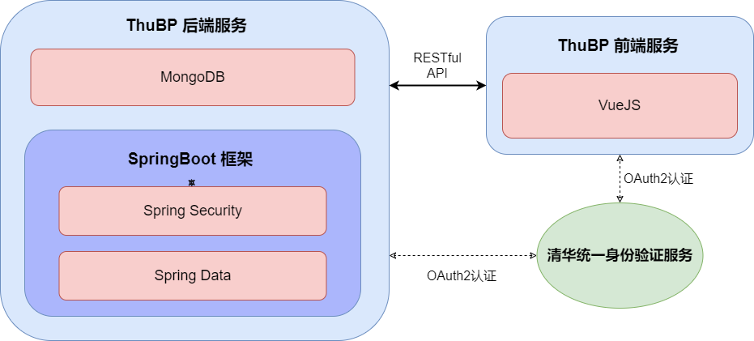
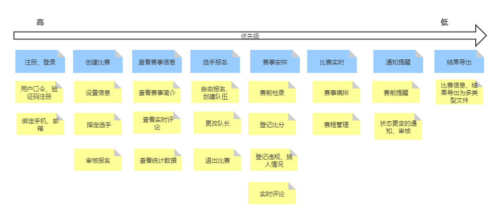

# 项目需求规格书

本项目需求规格书遵循 IEEE 830 规范。

## 1. 引言

### 1.1 目的

本规格书，旨在简洁及清晰的介绍本产品“清球汇”的软件轮廓，同时简要阐述产品中所使用的技术栈以及模块之间的依赖关系，并列举出开发过程中遇到的主要需求与解决方案。

本规格书的目的人群为：

- 项目组所有人员
- 测试组人员
- 球类赛事平台技术人员
- 项目经理

### 1.2 范围

- **产品名称**：清球汇（英文名：ThuBP）

- **产品定位及应用场景**：一个用于清华校内的综合性球类赛事管理系统，适用于篮球、乒乓球、网球、羽毛球等球类项目的赛事管理，简化人工操作，提高管理的准确性和效率。

### 1.3 定义、缩写词与简写

暂无

### 1.4 参考文献

[软件需求规格说明书 IEEE830 规范](http://www.math.uaa.alaska.edu/~afkjm/cs401/IEEE830.pdf)

[阿里巴巴 Java 开发手册](https://github.com/alibaba/p3c/blob/master/Java开发手册（嵩山版）.pdf)

[vue风格指南](https://cn.vuejs.org/v2/style-guide/)

### 1.5 概述

在剩下的章节中，我们将描述以下内容：

- 产品的综合描述
- 产品开发过程中的限制
- 产品使用过程中的依赖
- 产品的详细需求及其解决方案
- 产品模型图

## 2. 综合描述

### 2.1 产品前景

一个支持对阵模式的球类赛事管理系统，适用于篮球、乒乓球、网球、羽毛球、棒球等球类项目的校内赛事管理。

学校球赛中原本采用手工管理模式，工作效率较低且容易出错；而市场上现有的管理平台操作均较为复杂，且有功能冗余。因此希望面向清华师生，实现一个具有基本功能的球类赛事管理系统，使得校内球类赛事管理更加便捷高效。

本产品构思，借鉴于市面上已有的商业化产品——华羽体育，并打算在其繁杂的操作界面上进一步优化，得到一个专属于清华人的“简洁好用”的球类赛事管理平台。

本产品的总体框架模块之间的关系，见 4.1 章中”总体框架模块“图。

本产品的逻辑模块关系，见 4.1 章中”功能需求优先级“图。

#### 2.1.1 系统接口

球类赛事管理平台系统，至少需要拥有以下的接口：

- 管理比赛选手
- 管理比赛裁判
- 赛程管理
- 赛事编排
- 比赛检录
- 成绩登记

#### 2.1.2 用户接口

对于客户端，至少需要拥有以下的接口：

- 用户注册、登录与登出
- 组织者创建比赛
- 用户查看比赛

#### 2.1.3 软件接口

本产品依赖于以下软件产品和环境：

- Java JRE 1.8_271
- MongoDB
- NodeJS

#### 2.1.4 内存限制

为保证产品效果，内存建议在 2 GiB 及以上。

### 2.2 产品功能

具有用户注册登录、创建比赛、比赛信息发布、选手报名、裁判管理、赛事编排、赛程管理、赛前通知、签到检录、比赛记分、赛况实时、成绩导出，以及其他额外功能。

### 2.3 用户特征

产品主要面向举办和参加球类比赛的清华师生，包括赛事组织方、工作人员（裁判）、选手和观众。

- 赛事组织方：是比赛项目发起人，负责赛事的各类信息管理与公布

- 裁判：是比赛成绩记录者，熟悉赛事规则，但年纪较大的体育老师不一定能熟练操作电子记录表格

- 选手和观众：是比赛项目参与者和关注者，熟悉赛事规则，一般能较好地使用平台进行报名。

在赛事的赛程观察和比分查看界面，面向的用户整体年龄段偏年轻，且整体素质较高，操作上不需要太多教程或引导，在电子设备操作的方面上有一定的自主摸索能力。

在比赛的组织方面，面向的用户年龄段横贯年轻到中老年区域，在 UI 设计上需要有更加明确的指引和流程指南。

不同身份用到的主要功能不同，可以据此将功能大致分类，使UI更清晰。

### 2.4 一般性限制

**前端限制**：

1. 开发语言及 IDE 环境：JavaScript + Typescript && WebStorm
2. 使用 Vue 框架 + Ant design vue 组件库
3. 需要应对用户的错误输入及各个控件的 state 处理更新
4. 需要对不同设备及浏览器进行兼容式+响应式处理

**后端限制**：

1. 校内用户身份安全：
2. 因为平台的目的对象为校内的教职工成员，故本平台需要按照校内身份验证安全的标准去制订和完善身份校验功能。
3. 开发语言及 IDE 环境：Java 1.8 && IDEA IntelliJ IDE
4. Spring 框架的依赖限制：由于采用 Java 中的 Spring 框架进行开发，因此尽量使用 Spring 框架中拥有的集成库工具，切勿未经讨论引用第三方库。
5. MongoDB 数据库限制：由于平台中的持久化数据种类繁多，故选择使用 NoSQL 的 MongoDB 数据库作为底层数据库。而且由于网络的身份验证采用无状态的 JWT 方式，故无需记录用户的 Session，故无需使用 Redis 等数据库。
6. 审计及日志功能：数据库审计功能由 Spring-MongoDB 库实现；日志功能由 SLF4J 库提供。
7. JWT 身份验证：为减少 Session 机制带来的数据库查询导致的性能损失，前后端使用 JWT 进行身份验证与授权。
8. RESTful 后端 API：后端的各个 API 接口中，需要满足 RESTful 的 API 制定规范，并且 Http 文本格式为 application/json

### 2.5 假设和依赖

假设：

1. 清华校内学生和教职工的球赛组织与记录等，都需要通过此应用来上传和统计。各类球类赛事的赛程和比分都需要通过此应用来查看。

依赖：

1. “JWT 身份验证”服务，依赖于学校提供的教职工/学生身份验证服务接口，需要通过学校的平台来认证身份。
2. 后端依赖于 Spring 框架和 MongoDB。
3. 前端依赖于 Vue 框架和 Ant design vue 等UI组件。

## 详细需求

### 3.1 功能需求

思路：列举每个功能点

- 描述和优先级
- 请求、响应序列
- 标注需求的相关特性

1. 用户注册、登录与登出   优先级：**高**

​        清华大学的学生和教职工首次注册时需要通过清华用户系统或邮箱实现身份的验证，然后设定昵称、密码等成为平台用户。完成注册后可以通过用户口令、密码、验证码等方式登入平台。此后系统会自动保持用户的登入状态，直至登出。

​        用户可以绑定手机、微信、QQ等第三方社交账号用于登录凭据找回。

请求：用户请求注册成为平台用户

响应：系统要求输入用户昵称 / 密码 / 清华邮箱 / 清华统一身份(学号和密码) ，返回注册结果，并推荐用户绑定手机号。

请求：用户请求登录

响应：系统在数据库中检索用户输入的用户学号 / 清华邮箱 / 手机号 及 相应密码，若账号存在且密码正确则通过

请求：用户请求绑定第三方社交账号

响应：系统将用户账户与第三方社交账号绑定

请求：用户请求登出

响应：系统得到用户确认后清除当前的登录信息。

2. 组织者创建比赛   优先级：**高**

​       平台用户可以填写比赛信息来创建比赛，需要填写的比赛信息包括名称、时间、地点、面向用户、赛事内容、赛制设置、是否公开、是否允许自由报名等。

时间特性要求：至少需要在比赛开始前【若干】天创建该比赛

请求：用户请求创建比赛

响应：系统要求用户填写上述的详细比赛信息

请求：用户确认创建比赛

响应：系统根据用户所选的相关选项决定是否公开比赛信息和开放报名入口

3. 用户查看比赛  优先级：**高**

用户可以通过 ID 或名称搜索到公开的赛事信息，也可以通过比赛组织者分享的链接查看非公开的赛事信息。在对应的比赛信息页面，用户可以查看比赛的时间、地点、赛制、赛事介绍、当前的参赛人数、裁判人员及比赛场数等信息。

请求：用户请求搜索比赛（仅限公开比赛）

响应：系统获取用户输入的ID或名称，在公开的比赛中进行模糊匹配并返回所有匹配的比赛的链接

请求：组织者请求分享比赛（公开与非公开均可）

响应：系统生成特定比赛的分享链接返回给用户

请求：用户点击比赛链接

响应：系统返回汇总该比赛所有信息的页面

4. 管理比赛选手 优先级：**高**

​        组织者可以指定参赛人选，也可以允许平台用户自由报名。团体赛中，组织者可以选定队伍和指派队长， 也可以允许报名用户自由创建队伍和决定队长，默认情况下创建队伍的用户自动成为该队队长，此后可以进行队长及人员的变更。被组织者直接选定时，系统会通知相应用户。当有选手自由报名、退出报名、创建队伍或变更队长时，系统也会通知组织者及时进行审核。

组织者可以设定在比赛开始一定时间前，不再允许其他用户进行报名、退出比赛、创建队伍、更改队长等操作。

请求：组织者请求指定参赛人选

响应：系统获取组织者所填人员名单，检查用户是否存在并发送通知

请求：用户请求报名参赛 / 退出比赛 / 创建队伍 / 变更队长

响应：系统向组织者发送相应人员及事件的审核通知，待组织者审核通过后实施变更，否则通知用户申请失败

请求：组织者设定 / 变更自由报名截止时间

响应：系统获取当前日期，计算报名剩余时间并显示报名倒计时，倒计时结束后关闭报名入口

5. 管理比赛裁判 优先级：**高**

 组织者可以通过输入学号和姓名来向自己的赛事裁判队伍中添加新裁判。进而为赛事中的每一场比赛指定裁判、删除裁判、修改裁判及需要多个裁判时指派分工。系统会通知被指定或被删除的裁判。

请求：组织者请求对比赛裁判进行增删改查

响应：系统对裁判的数据库进行相应操作，并向相关裁判发出通知

6. 赛事编排 优先级：**中**

组织者可以选择利用系统算法，根据现有的赛事参与者和赛制，进行随机抽签分组，以高效地得到每场比赛的对阵编排推荐结果，也可以在此基础上对参与人员及分组进行人工调整，以灵活处理特殊情况。比赛对阵编排结果在确认后会公布到比赛信息页面，供用户查看。

请求：组织者请求系统对现有参赛选手进行比赛编排

响应：系统获取现有参与人员名单及赛制，根据随机抽签算法得到编排后的对阵结果

请求：组织者请求对表格中的分组人员进行增删改查操作

响应：系统在现有编排结果的基础上进行相关操作

请求：组织者确认比赛的对阵编排结果

响应：系统将所确认的结果加入该赛事的赛事信息

7. 赛程管理 优先级：**中**

 组织者可以根据赛制和目前的赛程结果， 利用系统进行赛程管理， 预估的后续赛程对决安排，以提前考虑时间、场地等问题。已预测的后续赛程会公布到比赛信息页面，供用户查看。

请求：组织者录入当前已进行的比赛结果，请求后续赛程分析

响应：系统获取当前比赛的赛制和已知比赛结果，通过赛程分析输出预估的后续赛程安排，并在相应的比赛页面进行实时更新。

8. 比赛检录 优先级：**低**

 组织者和裁判可以记录选手到场的状态，并在系统上进行登记。

请求：组织者或裁判记录选手到场状态。

响应：系统修改选手状态，登入数据库。

9. 比赛实时 优先级：**低**

裁判可以实时录入或修改比赛双方的得分、违规、判罚等记录。

（可选功能：观众可以在对应的比赛页面的评论区发布评论，实时交流比赛状况。）

请求：裁判记录或修改比赛双方的得分、违规等记录。

响应：系统修改比赛信息，修改数据库。

*请求：观众在比赛页面评论区发布评论。

*响应：系统实时的将评论登入该场比赛数据，并展示在页面上。

10. 成绩登记 优先级：**中**

裁判可以当场发布比赛的最终比分，比赛双方的代表可以在成绩发布的一段时间内进行确认或申诉，在双方都确认得分之后，组织者将正式登记成绩，否则需要对相应申诉进行审核并决定是否修改成绩，之后组织者可以将比赛结果、赛时记录、犯规情况、得分情况导出为不同类型的数据文件。

用户友好性与操作便捷性：要求较高，需要在比赛过程中快速记录

虑请求：裁判登记比赛得分。

响应：系统登记比赛得分，但此时分数可修改。

请求：比赛双方确认比赛得分。

响应：系统登记为比赛的最终得分。

请求：有比赛方提出申诉。

响应：系统将该申诉通知给组织者。

请求：组织者审核申请。

响应：系统确认比赛最终得分。

请求：组织者请求将比赛信息导出为文件。

响应：系统根据用户需求将不同的数据导出为不同类型的文件。

### 3.2 外部接口需求

#### 3.2.1 用户界面需求

暂定用户页面为网页端，主体为四个页面，登录页面+主平台页面+比赛页面+用户中心页面。

用户可以在登录/注册页面，输入昵称/密码，并通过调用清华身份认证的API，完成身份认证和用户注册。在之后即可以直接通过昵称+密码的方式登录，同时也可以通过清华证件号+密码的方式登录。

用户登录后即跳转到主平台页面。可以在主平台页面通过模糊匹配搜索到公开的比赛。同时在主页面会展示当前最热比赛（暂定截止日期+比赛选手人数加权排序获得）

在用户中心页面可以看到自己创建的比赛和参加的比赛，也可以获得站内的审核等信息。

从用户中心进入的比赛页面和在主平台/搜索进入的比赛页面为相同页面，针对不同用户角色展示不同的数据。如果是创建者，则可以看到比赛选手、比赛章程、比赛得分等信息。如果是普通用户，则只能看到比赛信息、比赛规则、已确定的比赛比分等信息。

#### 3.2.2 软件接口需求

1. 项目应当与清华统一身份认证API相对接，以完成清华师生的身份认证和信息获取
2. 前端网页应当与后端服务器实现良好的对接，以完成各项功能
3. 后端服务器应当与数据库独立设计并良好对接， 以实现对数据库的便捷操作和调整

### 3.3 性能需求

1. 拥有跨平台部署功能，且允许多终端负载均衡。
2. 在请求峰值期，需要达到至少 1000 TPS 的吞吐能力，同时每个请求的处理时延在 500ms 以内，请求成功率在 99% 以上。
3. 实时比分查询功能，数据更新的延时不得超过 10s。
4. 前端在移动端上运行需要达到流畅级别，进行某个功能时，不能有明显的阻塞或者卡顿。

### 3.4 质量属性

#### 3.4.1 可靠性

为使产品运行性能具有可靠性，请于具有稳定 JRE 的设备上运行后端，且后端端口需要对外开放。

若运行前端，最好拥有稳定的可供外网访问的 IP 地址，并且以 Nginx 部署前端服务。

#### 3.4.2 安全性

为保证产品运行中的安全性，需要部署端有一定的抗 DDoS 能力，并且在系统级层面上可保留程序安全日志。

#### 3.4.3 便携性

在安装 JRE 8 的机器上，都可以运行后端。

在装有 NodeJS 和 Nginx 的机器上，都可以运行前端。

### 3.5 安全需求

1. 平台用户注册需要通过校内 OAuth2 认证，并且平台后台不保留涉及个人隐私的信息。
2. 只有系统管理员可以获取到用户的全部信息，普通用户只能查看其他用户公开的个人信息。
3. 系统对用户的关键信息进行加密

### 3.6 设计限制

本项目采用了已有的如下规范：

- 前端 Vue 开发遵守 *Vue风格指南*。

- 后端 Java 开发遵守 *阿里巴巴 Java开发手册规范。*

### 3.7 其他需求

管理需求：使用docker部署，前端应用与后端数据库分离。

维护需求：在git上实现迭代开发。

启动需求：能够直接通过浏览器直接访问。

## 4. 支持信息

### 4.1 分析模型

总体框架模块图：

功能需求优先级：

### 4.2 待确定问题的列表

- 校友身份验证